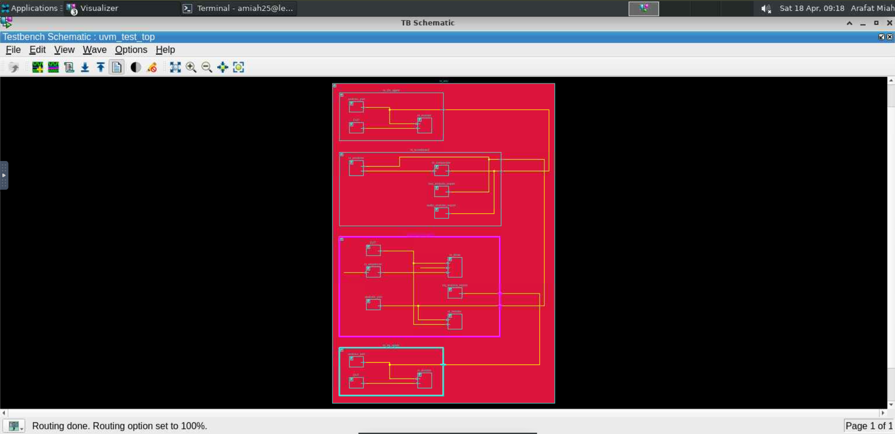
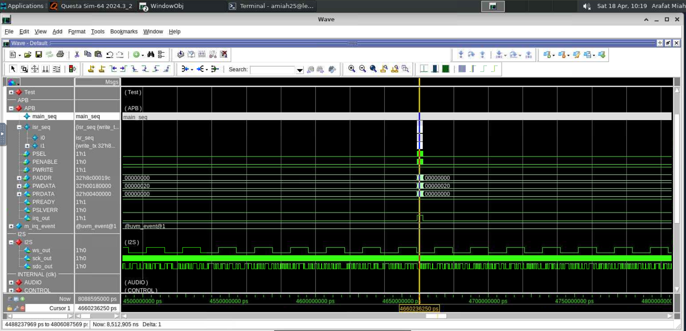
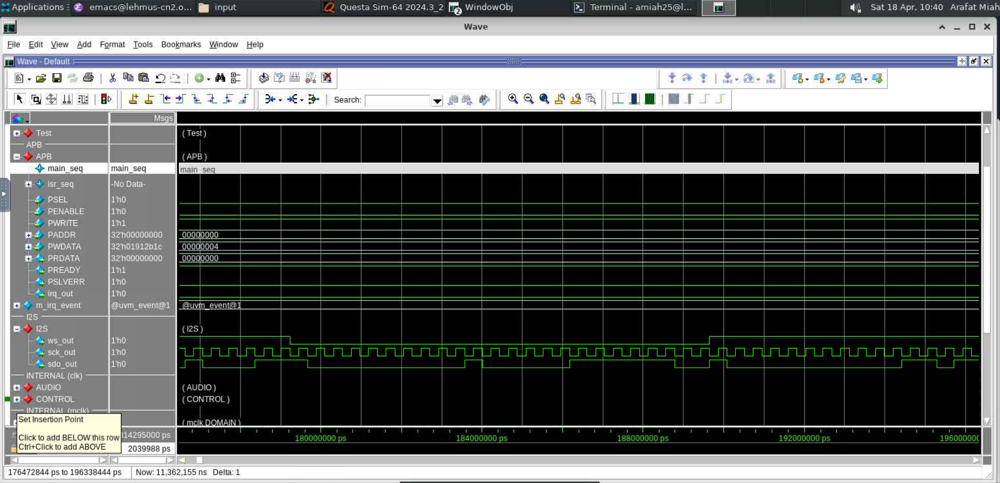
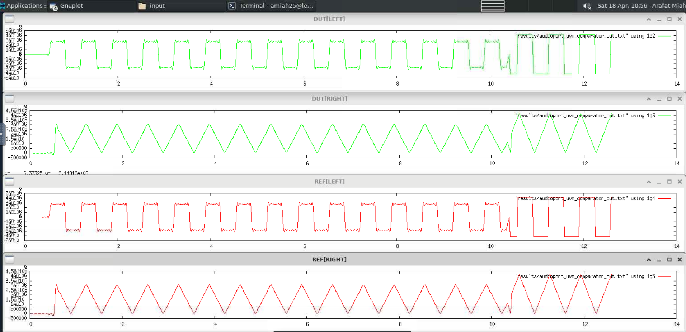
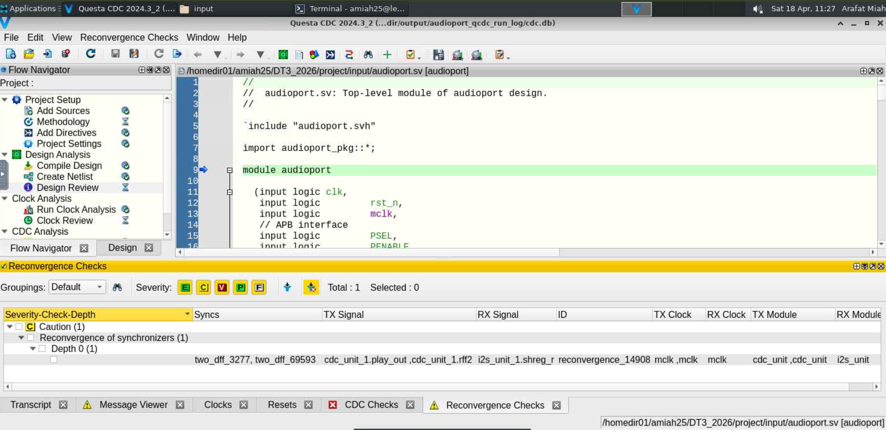
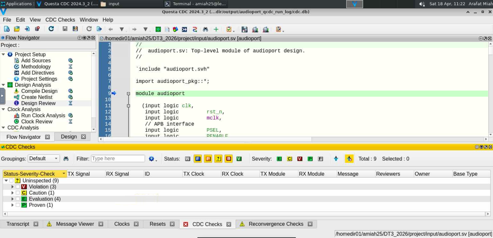
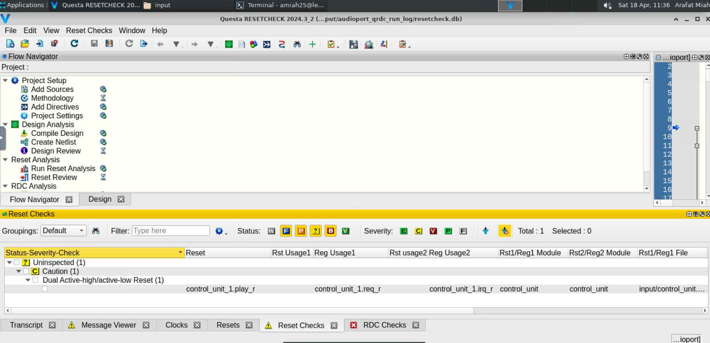
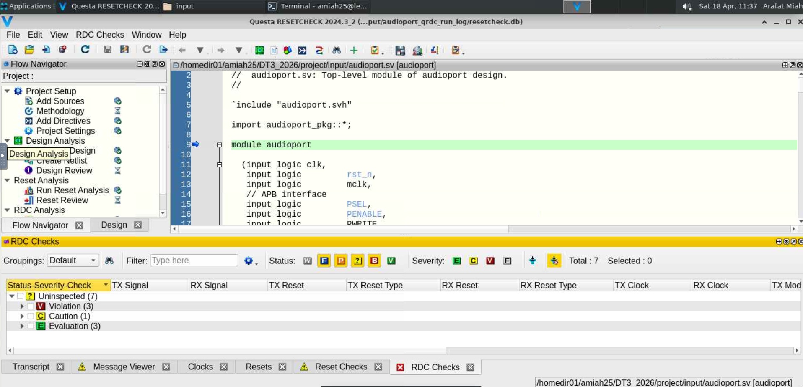

# Week 15: Full UVM Testbench Integration, Data Validation, & Static Analysis

## 📖 What is this week about?
The primary objective of Week 15 was to integrate all previously developed UVM components into a final, unified verification environment for the `audioport` IP block. 

Moving beyond isolated control unit testing, the challenge this week was to test the complete system—including the DSP datapath and audio interfaces. The environment needed to establish full Transaction Level Modeling (TLM) routing between agents and a scoreboard to mathematically validate the audio output against a reference model. Furthermore, this week transitioned from dynamic simulation to advanced static analysis, focusing on **Clock Domain Crossing (CDC)** and **Reset Domain Crossing (RDC)** checks to ensure the design is viable for physical silicon implementation.

## 🛠️ What I Created
To achieve this, I connected the final pieces of the UVM architecture and executed comprehensive system validations:

* **`audioport_env`**: The master container. I instantiated the complete top-level UVM environment, properly routing the TLM analysis ports between the `control_unit_agent`, `irq_agent`, `i2s_agent`, and connecting them directly to the `audioport_scoreboard` for real-time data checking.
* **UVM Factory Overrides**: Utilized the UVM factory pattern within `audioport_uvm_test` to dynamically override empty "base" sequences with real `audioport_main_sequence` and `audioport_isr_sequence` classes, allowing test flexibility without altering the underlying environment architecture.
* **Static Analysis Execution (CDC/RDC)**: Beyond UVM, I utilized Siemens Questa CDC and RESETCHECK to perform structural static analysis on the RTL, identifying critical architectural hazards across multiple asynchronous clock and reset domains.

## 📊 Results & Proof of Concept
The testbench was compiled and simulated using Siemens QuestaSim. The waveforms, schematics, and reports provided in this repository definitively prove the system's functional correctness and highlight critical static analysis findings:

1. **Architecture Verification**: The Visualizer schematic confirms that all UVM components were instantiated correctly and that the yellow TLM analysis port wires were successfully routed between the agents and the scoreboard.

2. **Hardware/Software Interrupt Synchronization**: The waveform demonstrates the `isr_seq` waking up perfectly in response to the hardware `irq_out` signal, firing a dense burst of APB transactions to keep the I2S audio (`ws_out`, `sck_out`, `sdo_out`) streaming without starvation.

3. **Steady-State VCD Capture**: Captured a steady-state 15µs operational window (180µs to 195µs) demonstrating stable audio processing, which is critical for subsequent power estimation phases.

4. **Perfect Data Match (DUT vs. REF)**: Mathematical proof of success. Both the Gnuplot rendering and the QuestaSim waveform prove that the physical hardware output (DUT, green) perfectly overlaps the UVM reference model predictions (REF, red) across square and triangle wave generations. The comparator reported zero errors.

5. **CDC & RDC Static Analysis**: Tool outputs detailing structural warnings that must be addressed before physical synthesis. This includes a caution regarding the reconvergence of synchronizers in the `cdc_unit` and a warning regarding mixed active-high/active-low reset polarities in the `control_unit`.

## 📂 Repository Files
*(Note: SystemVerilog header files have been uploaded as `.txt` for easy repository viewing).*

* `audioport_env.txt` - UVM Environment instantiation and TLM connection phase.
* `audioport_uvm_test_env.png` - Schematic of the UVM hierarchy.
* `audioport_uvm_test_apb_waves.png` - Waveform showing the UVM interrupt sequence servicing the hardware.
* `audioport_vcd_dump_interval.png` - Waveform showing the steady-state 15µs VCD capture window.
* `audioport_uvm_test_gnuplot.png` - Gnuplot graph proving DUT and REF audio data match perfectly.
* `DUT vs REF curve matched perfectly.png` - QuestaSim waveform showing identical DUT and REF outputs.
* `cdc_checks.png` - Summary table of Clock Domain Crossing violations.
* `crd_reconvergence_check.png` - Detailed warning regarding CDC synchronizer reconvergence.
* `RDC_check.png` - Summary table of Reset Domain Crossing violations.
* `RDC_reset_check.png` - Detailed warning regarding dual active-high/low reset polarities.

## 🧠 What I Learned This Week

* **Accelerated Workflow:** I completed this entire complex verification flow in just 9 hours over 2 days. The steep learning curve of UVM theories and object-oriented programming I climbed in Weeks 13 and 14 paid off massively, allowing me to build and connect components rapidly and efficiently.
* **UVM Factory Pattern:** I learned how to use `set_type_override` to swap out test sequences on the fly, demonstrating the true modular power and reusability of the UVM framework.
* **Automated Checking:** I discovered the power of UVM scoreboards and comparators to mathematically validate thousands of data points against a reference model instantly, replacing tedious manual waveform inspection.
* **Static Analysis (CDC/RDC):** I gained vital industry-standard skills in analyzing Clock and Reset Domain Crossings. I learned that a design that passes dynamic simulation can still fail in physical silicon if asynchronous domains and synchronizer reconvergences aren't handled properly.
* **AI-Assisted Engineering:** I continued to use AI as a guiding tool throughout this module. When faced with complex EDA tool outputs (like deciphering CDC reconvergence warnings) or advanced UVM architecture questions, I used AI as an interactive tutor to clarify the concepts, while ensuring all code and design implementation remained strictly my own work.

## Disclaimer
This repository contains **only a portion of the full laboratory project** and is shared **solely for demonstration and portfolio purposes**.

It is **not intended to be used as a solution reference** for academic coursework or assessments.  
Any reuse should be for learning or professional evaluation only.

---

## Author
**Arafat Miah** 
**Digital Design**
